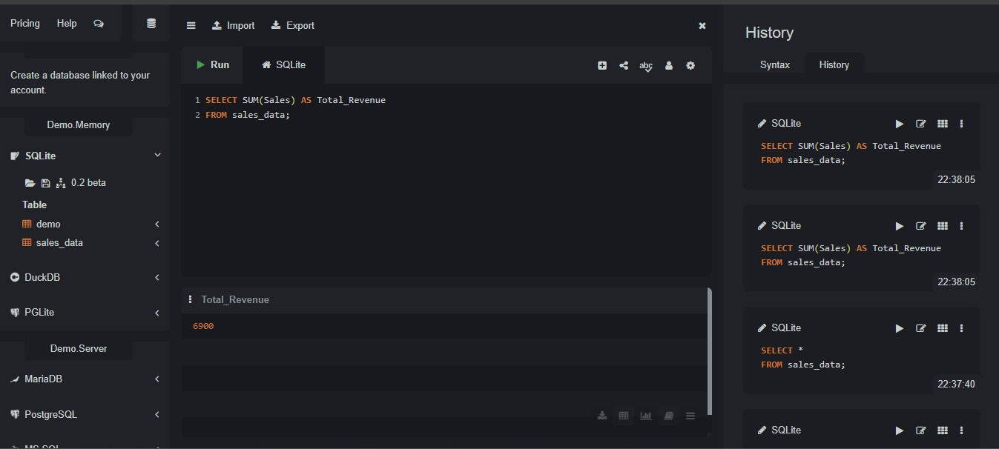
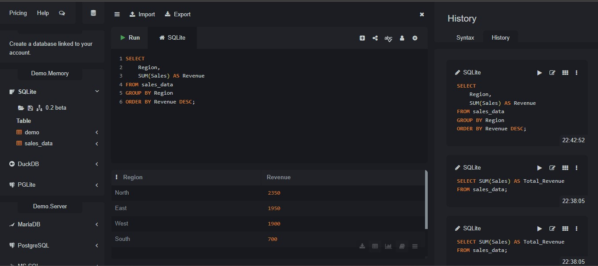
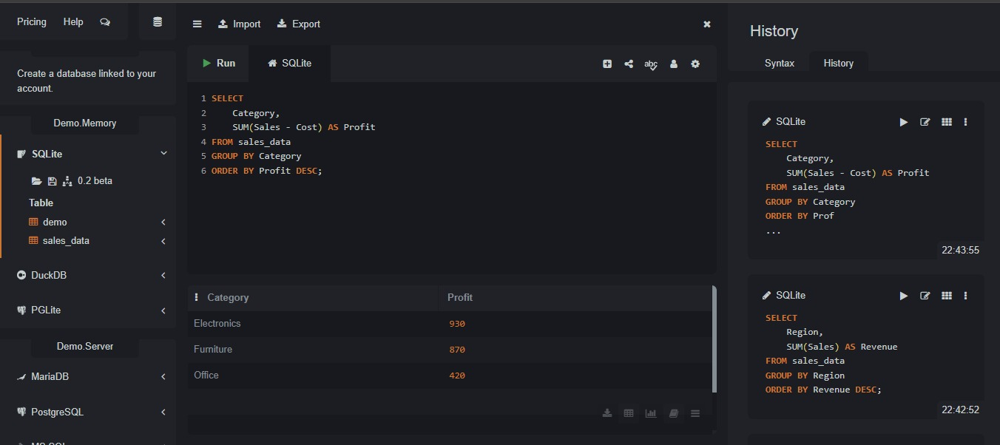

# 📊 Sales Performance Analysis with SQL

## 📌 Project Overview

This project was developed to practice SQL for data analysis and business intelligence.

Using a sales dataset, SQL queries were created to answer key business questions related to revenue, profitability, product performance, regional sales, and monthly trends.

---

## 🎯 Business Objective

The objective of this analysis is to transform raw sales data into actionable business insights using SQL.

The project focuses on identifying:

* Revenue performance
* Best-performing regions
* Top-selling products
* Most profitable categories
* Average order value
* Monthly sales trends

---

## 📂 Dataset

The dataset contains transactional sales data with the following fields:

* Date
* Region
* Category
* Product
* Sales
* Cost
* Quantity

---

## ❓ Business Questions

### 1. What is the total sales revenue?

**Answer:** 6,900

### 2. Which region generated the highest revenue?

**Answer:** North (2,350)

### 3. Which products sold the most units?

**Answer:** Keyboard (10 units)

### 4. Which category generated the highest profit?

**Answer:** Electronics (930)

### 5. What is the average order value?

**Answer:** 575

### 6. Which month had the best sales performance?

**Answer:** January 2025 (2,800)

---

## 📈 Key Insights

* Total revenue reached 6,900.
* North was the highest-performing region.
* Keyboard was the best-selling product.
* Electronics generated the highest profit.
* Average order value was 575.
* January 2025 achieved the strongest sales performance.

---

## 🖼 Query Results

Below are screenshots showing the SQL queries and outputs generated during the analysis.

## Total Revenue



## Revenue by Region



## Profit by Category



---

## 🛠 Technologies Used

* SQL
* SQLite
* Git
* GitHub

---

## 📁 Project Structure

```text
Sales-Performance-Analysis-with-SQL
│
├── README.md
├── Data
│   └── sales_data.csv
├── Images
│   ├── Total_Revenue.jpeg
│   ├── Revenue_by_Region.jpeg
│   └── Profit_by_Category.jpeg
├── SQL
│   └── business_questions.sql
```

---

## 🎓 What I Learned

Through this project, I strengthened my skills in:

- Writing SQL queries to answer business questions
- Using aggregate functions such as SUM(), AVG(), and GROUP BY
- Analyzing sales performance and business metrics
- Transforming raw data into actionable insights
- Organizing and documenting projects on GitHub
- Presenting analytical results in a clear and structured format

---

## 👨‍💻 Author

**Marcos Rogério da Silva**

Trade Marketing | Business Intelligence | Data Analytics

* GitHub: https://github.com/marcosrdevbr
* LinkedIn: https://www.linkedin.com/in/marcos-rogerio-017923302/

Feel free to connect or share feedback about this project.

---

## ⭐ If you found this project interesting

If you enjoyed this project or found it useful, feel free to connect with me on LinkedIn or explore my other repositories on GitHub.

Thank you for visiting my portfolio!
